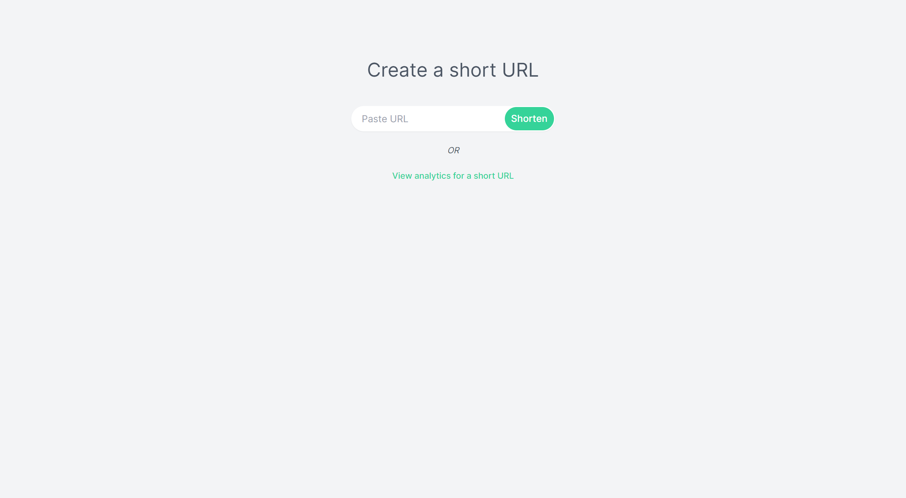
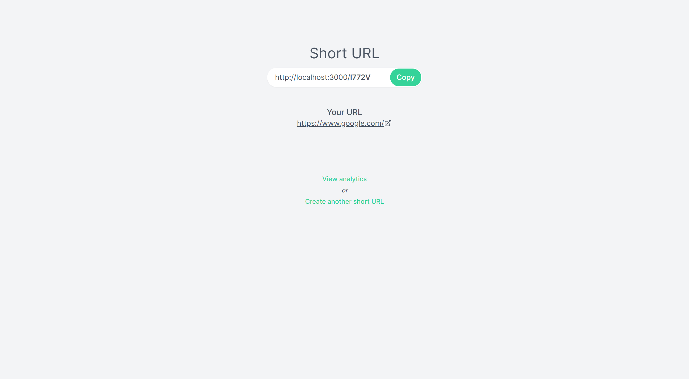
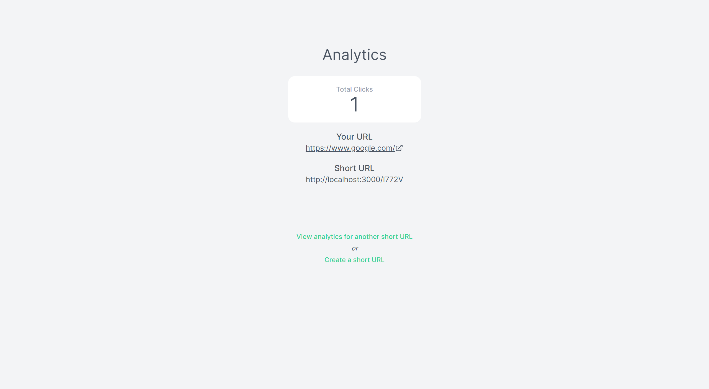

# URL Shortener

A URL shortener that redirect visitors to the original URL when visited.

1. [**Gin Framework**](https://gin-gonic.com/) - Full-featured web framework for Go
2. [**Gorm**](https://gorm.io/index.html) - ORM library for Golang

## Installation & Run

```bash
# Navigate to url-shortener
$ cd url-shortener

# Start Frontend
$ npm run frontend

# Start Backend
$ npm run backend
```

## Screenshot





## API

### /url

- `POST` : Receive a URL and generate a short URL

#### Request Samples

```
{
    "url": "https://www.google.com/"
}
```

#### Response Samples

```
{
    "id": "I772V",
    "originalURL": "https://www.google.com/",
    "visitCount": 0
}
```

### /url/:id

- `GET` : Retrieve a short URL

#### Response Samples

```
{
    "id": "I772V",
    "originalURL": "https://www.google.com/",
    "visitCount": 0
}
```

### /url/:id/visit

- `POST` : Retrieve short URL for the purpose of redirecting user to original URL

#### Response Samples

```
{
    "id": "I772V",
    "originalURL": "https://www.google.com/",
    "visitCount": 1
}
```
